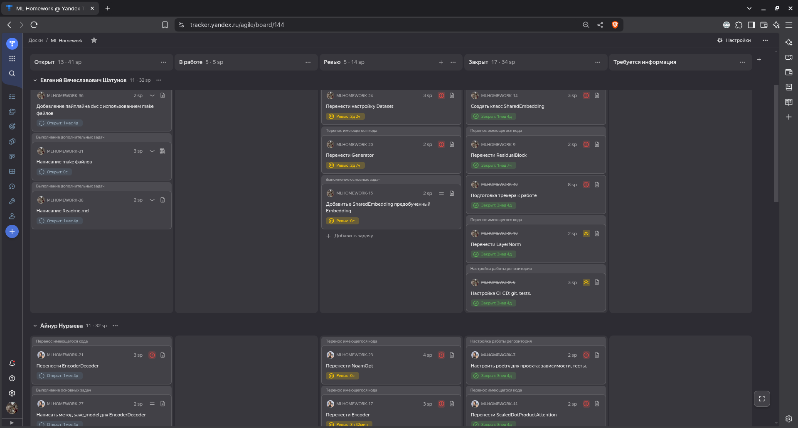

# HW_3
Реализация модели Transformer для задачи Abstract Summarization в рамках домашней работы по курсу ML.


Проект выполнен студентами 3 курса МФТИ ПИШ ФАЛТ:
* Ищенко Игорем Олеговичем
* Нурыевой Айнур
* Шатуновым Евгением Вячеславовичем
____
# Описание задачи

Реализация алгоритма, который способен по принимаемой на вход новости выдать сгенерированный заголовок.

**Пример:**
>Еще одним совместным авиационным проектом является разработка российского регионального самолета RRJ
(Russian Regional Jet). Над этим проектом работают ряд российских и зарубежных фирм, наиболее крупные из которых -
производители авиадвигателей НПО ""Сатурн"" (Россия) и Snecma (Франция), компания Thales, разрабатывающая электронное
оборудование, и известный американский концерн Boeing, обеспечивающий технологию проектирования и сертификацию RRJ.
Возможно, к ним присоединится индийская корпорация Hindustan Aeronautics Ltd. (HAL), которая уже выразила
заинтересованность в финансировании проекта.

**Результат работы модели:**
>Россия и Франция построят совместный супервертолет.

К минимально реализованному алгоритму также требовалось:
* Добавить генератор суммаризации для модели, привести демонстрацию результата.
* Добавить оценку для модели с помощью ROUGE metric.
* Добавить визуализацию механизма attention после обучения модели на конкретном примере.
* Сделать общими матрицы эмбеддингов (в Encoder, Decoder и выходе Decoder).
* Применить функцию ошибки LabelSmoothing.
* Добавить предодученные эмбединги при обучении модели.
* Написать тесты к исходному коду.
* Приложить пайплайн dvc.
* Добавить make команды для запуска отдельных этапов выполнения кода.
____
# Рабочий процесс

* **Весь контроль над процессом работы вёлся с помощью Яндекс Трекера.**

    Был создан проект с расписанными задачами, начиная
    от переноса кода по модулям, заканчивая выполнением всех обязательных и дополнительных задач.

    


* **Использовалась Agile методика.**

    Проводилось покер-планирование, группы задач были разбиты по 3 спринтам.

    


* **Для удобной работы в репозитории было создано соглашение о наименовании коммитов, веток и MR.**
  * Коммиты: <тип>:<изменение>
  * Ветки: <тип>/<область работы>-<цель работы>
  * MR: <тип>/<область работы>-<цель работы> со ссылкой на задачу из трекера.


* **С целью контроля качества кода и работы с git использовались прекоммиты.**

    Подробную конфигурацию можно найти в файле: ```.pre-commit-config.yaml```

    Туда были добавлены:
  * ruff для форматирования и линта кода
  * Проверка YAML и JSON файлов
  * Контроль сообщения коммитов
  * Проверка конфликтов слияния


* **Для проверки вливаемого кода был написан пайплайн CI/CD.**

    CI/CD совершает сборку кода, проверяет формат, запускает линтер и тесты.
    Полный пайплайн находится здесь: ```.github/workflows/.github-ci.yaml```


* **Важным принципом работы был запрет на вливание в main без проверки кода всеми членами команды.**

    Такой подход позволил лучше познакомиться с кодом всего проекта каждым его участником.


* **Для комфортной работы с окружением был выбран Poetry.**

    Poetry помог проще настроить систему тестирования, управлять путями к написанным программным модулям,
    подобрать подходящие версии библиотек и настроить использование автоформата кода.


* **Была написана система тестов, покрывающая весь код на 98%.**

    Минимальным требованием был выбран порог 80%.


* **Команда тщательно подходила к документации и доработкам исходного кода.**

    Все функции были задокументированы, а сложные моменты в их реализации дополнительно пояснены.
    Найденные недочёты были исправлены, код был сделан более читаемым там, где это было необходимо.
____
# Распределение задач
### Ищенко Игорь
* Добавление и тестирование Rouge метрики
* Перенос и тестирование PositionwiseFeedForward
* Перенос и тестирование PositionalEncoding
* Перенос и тестирование Decoder
* Перенос и тестирование DecoderLayer
* Создание и настройка репозитория, в т.ч. pre-commit, pre-push и т.д.
* Перенос и тестирование функций масок и обработки batch
* Перенос и тестирование do_epoch, fit и main функции
* Написание и тестирование функции для демонстрации работы attention
* Добавление подключения wandb

### Шатунов Евгений

* Подготовка трекера к работе
* Написание Readme.md
* Настройка CI-CD: git, tests.
* Перенос и тестирование ResidualBlock
* Перенос и тестирование LayerNorm
* Создание и тестировние класса SharedEmbedding
* Добавление в SharedEmbedding предобученный Embedding и его тестирование
* Демонстрация разницы в качестве модели при использовании предобученных эмбеддингов и без них
* Перенос и тестирование Generator
* Перенос и тестирование настройки Dataset
* Добавление пайплайна dvc с использованием make файлов
* Написание make файлов

### Нурыева Айнур
* Настройка poetry для проекта: зависимости, тесты.
* Перенос и тестирование ScaledDotProductAttention
* Перенос и тестирование MultiHeadedAttention
* Перенос и тестирование EncoderBlock
* Перенос и тестирование Encoder
* Перенос и тестирование EncoderDecoder
* Перенос и тестирование NoamOpt
* Написание и тестирование predict метода для EncoderDecoder
* Написание и тестирование метода save_model для EncoderDecoder
* Создание и тестирование класса LabelSmoothingLoss
* Написание кода-демонстрации работы модели
____
# Установка окружения
Сперва установите `poetry`
```bash
pip install poetry
```

Для создания окружения и установки всех нужных пакетов запустите
```bash
make install
```

Для установки хуков
```bash
make hooks
```

Для запуска линтеров
```bash
make lint
```

Для запуска тестов
```bash
make test
```

Для обновления и фиксации зависимостей
```bash
poetry lock
```

Для активации виртуального окружения скопируйте то, что выдает эта команда и запустите скопированную команду
```bash
poetry env use python3.12
poetry env activate
```

Для установки данных для обучения
```bash
mkdir -p data/raw
wget -O data/raw/news.zip -qq --no-check-certificate "https://drive.google.com/uc?export=download&id=1hIVVpBqM6VU4n3ERkKq4tFaH4sKN0Hab"
unzip data/raw/news.zip -d data/raw
rm data/raw/news.zip
```

Для установки предобученного эмбединга
```bash
mkdir -p ./embeddings
wget -P ./embeddings https://storage.yandexcloud.net/natasha-navec/packs/navec_hudlit_v1_12B_500K_300d_100q.tar
```

# Структура проекта

```
project_root/
├── .git/                    # Git repository (managed by Git)
├── .dvc/                    # DVC metadata directory (managed by DVC)
├── .wandb/                  # Weights & Biases local data (often hidden)
├── src/                     # Source code directory
│   ├── __init__.py
│   ├── model/               # Transformer model src code
│   │   ├── __init__.py
│   │   ├── *.py             # Class definitions, architectures
│   │   ├── *.py             # Helper functions for model loading, saving, etc.
│   ├── data/                # Data processing and loading
│   │   ├── __init__.py
│   │   ├── data_loader.py   # Loads the database
│   │   ├── preprocessing.py # Data cleaning, normalization
│   ├── features/            # Feature engineering
│   │   ├── __init__.py
│   │   ├── feature_engineering.py  # Feature extraction functions
│   ├── utils/               # Utility functions and modules
│   │   ├── __init__.py
│   │   ├── *.py
│   ├── main.py
│
├── data/                    # Raw data and processed data
│   ├── raw/                 # Original, unprocessed data (DVC tracked)
│   │   ├── news.csv
│   ├── processed/           # Processed data (DVC tracked)
│   │   ├── processed_data.csv
│
├── model/                   # Trained model weights and configurations (DVC tracked)
│   │   ├── model.pt         # PyTorch weights (or .pkl for scikit-learn, etc.)
│   │   ├── config.json      # Model configuration (hyperparameters)
│
├── notebooks/               # Jupyter notebooks for demonstration
│
├── tests/                   # Tests directory
│   ├── __init__.py
│
```
